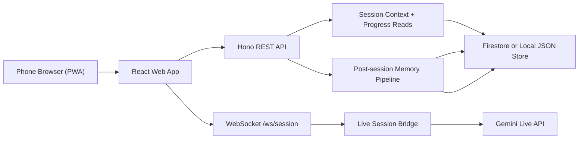
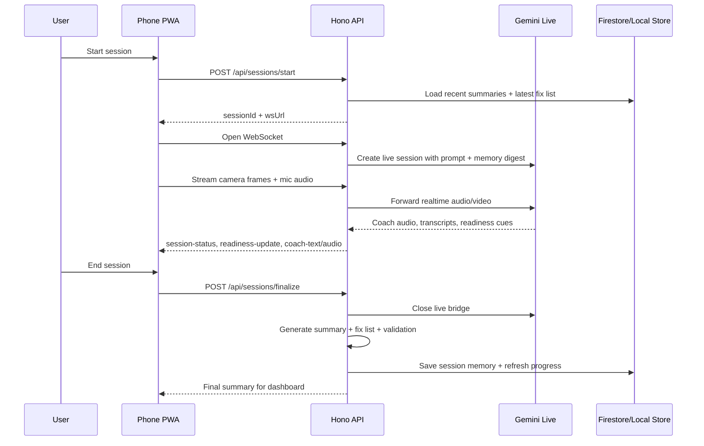
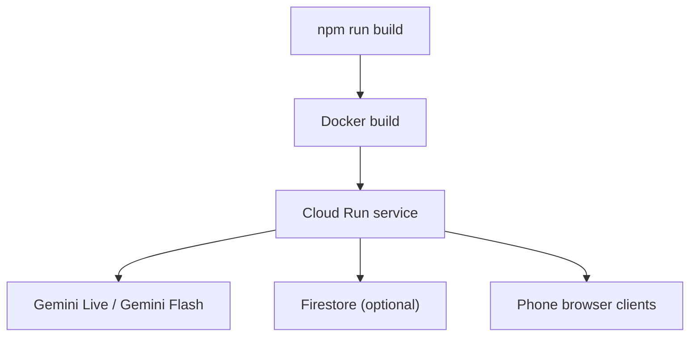

# Mentat MVP Architecture

Mentat ships as a single Cloud Run service for the hackathon MVP:
- the React PWA is built into `apps/web/dist`
- the Hono API serves REST routes, WebSocket upgrades, and the static web build
- Gemini Live handles real-time audio/video coaching
- Firestore is optional in production, with a local JSON repository fallback for development

## System view

## Live coaching flow

## Deployment shape

## Notes

- The readiness gate is part of the live bridge, not just the UI. The session stays in `readiness` until framing, racket visibility, and stance are confirmed.
- The post-session memory pipeline writes:
  - validated session summary
  - compressed summary for future context
  - fix list
  - derived progress snapshot
- The local fallback repository lives under `apps/api/data/` and is ignored by git.
